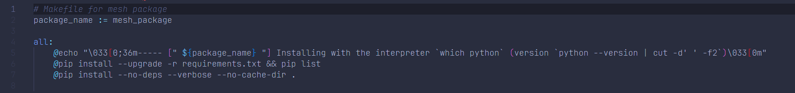

# Resolving 3D Human Pose Ambiguities with 3D Scene Constraints

[[Project Page](https://prox.is.tue.mpg.de/)]
[[Paper](https://ps.is.tuebingen.mpg.de/uploads_file/attachment/attachment/530/ICCV_2019___PROX.pdf)]


## Reference

This repository source code,please refer to [prox source code](https://github.com/mohamedhassanmus/prox).

## Dependencies

详情请参考钉钉文档papersCode config/prox

请下载阿里云盘[papersCode/prox](https://www.alipan.com/s/5icJ2NtHrtu)下model文件夹，放在root目录

仓库结构图

```markdown
prox/
├── cfg_files
│   ├── PROXD.yaml
│   ├── PROX.yaml
│   ├── RGB.yaml
│   └── SMPLifyD.yaml
├── generate_sh.py
├── images
│   ├── bug_chamber.png
│   ├── bug_mesh.png
│   ├── image-20231222162355416.png
│   ├── image-20231222162541971.png
│   ├── makefile.png
│   └── teaser.jpg
├── input
│   ├── body_segments
│   ├── calibration
│   ├── camera
│   ├── keypoints
│   └── recordings
├── models                                        #下载阿里云盘papersCode/prox下model文件夹
│   ├── smplx
│   ├── smplx_models
│   ├── smplx_parts_segm.pkl
│   └── vposer_v1_0
├── output
│   ├── s01_001_60457274_193
│   ├── s01_001_65906101_193
├── prox
│   ├── align_RGBD.py
│   ├── camera.py
│   ├── cmd_parser.py
│   ├── data_parser.py
│   ├── dist_chamfer.py
│   ├── fit_single_frame.py
│   ├── fitting.py
│   ├── __init__.py
│   ├── main.py
│   ├── misc_utils.py
│   ├── optimizers
│   ├── prior.py
│   ├── projection_utils.py
│   ├── renderer.py
│   ├── render_results.py
│   ├── render.sh
│   └── viz
├── prox.sh
├── README.md
|── requirements.txt
```

1. 创建prox虚拟环境

```bash
# 创建prox虚拟环境
conda create -n prox python=3.9
conda activate prox
```

2. 安装[pytorch 1.13.1](https://pytorch.org/get-started/previous-versions/)

```bash
pip install torch==1.13.1 torchvision==0.14.1 torchaudio==0.13.1
```

3. 安装requirements.txt

```bash
pip install -r requirements.txt
```

Then follow the installation instructions for each of the following before using the fitting code.

1. Install mesh processing libraries from [MPI-IS/mesh](https://github.com/MPI-IS/mesh) within the virtual environment on linux

   ```bash
   sudo apt-get install libboost-dev
   # compile and install the psbody-mesh package easily using the Makefile
   git clone https://github.com/MPI-IS/mesh.git # or git clone
   cd GDPnet/mesh && make all
   # test
   make tests
   # A detailed documentation can be compiled using the Makefile
   make documentation
   ```

   - bug：
     - 
     - 删除`Makefile`：--install-option="--boost-location=$$BOOST_INCLUDE_DIRS"
     - 

2. [Chamfer Distance](https://github.com/ThibaultGROUEIX/chamfer_pytorch/tree/719b0f1ca5ba370616cb837c03ab88d9a88173ff)

   - bug
     - 

   - cuda版本不对应，修改cuda为11.7（于pytorch版本一致）

3. bug

   - 

4. [PyTorch Mesh self-intersection](https://github.com/vchoutas/torch-mesh-isect) for interpenetration penalty

   * Download the per-triangle part segmentation: [smplx_parts_segm.pkl](https://owncloud.tuebingen.mpg.de/index.php/s/MWnr8Kso4K8T8at)

The code has been tested with Python 3.9, CUDA 11.7, CuDNN 7.3 and PyTorch 1.13.1 on Ubuntu 22.04.3
